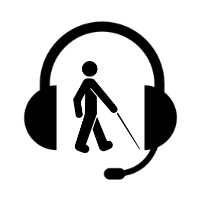

# Blind Assistant

## Description
This project tries to build an assistant for visually impaired persons.

### Main Features
**Avoid obstacles:** ultrasonic sensors are used to detect obstacles and warn the user through earphones.
**Read documents:** we use OCR to extract text from images and convert it to speech.

## Dependencies
- [python3](https://www.python.org/)  
- [tesseract-ocr](https://github.com/tesseract-ocr/tesseract)  
- [opencv](https://opencv.org/)

## Usage
To use the project install dependencies and run the main script.

    # install dependencies
    $ sudo apt update && apt install -y tesseract-ocr tesseract-ocr-eng python3 python3-pip

    $ git clone https://github.com/Zied-Guesmi/blind-assistant.git && cd blind-assistant/
    $ pip3 install -r requirements.txt
    $ python3 src/main.py

## Docker deployment
After installing [docker](https://docs.docker.com/install/), just grab the docker image from dockerhub and run it:

    $ docker run ziedguesmi/blind-assistant

Or you can build your own image from dockerfile:

    # clone the project
    $ git clone https://github.com/Zied-Guesmi/blind-assistant.git && cd blind-assistant/

    # build the docker image
    $ docker build -t blind-assistant .

    # run the container
    $ docker run blind-assistant

## TODO
- Support more languages.

## Authors
- **[Zied Guesmi](https://github.com/Zied-Guesmi)**

## License
This project is licensed under the MIT License - see the [LICENSE](https://github.com/Zied-Guesmi/blind-assistant/blob/master/LICENSE) file for details.
